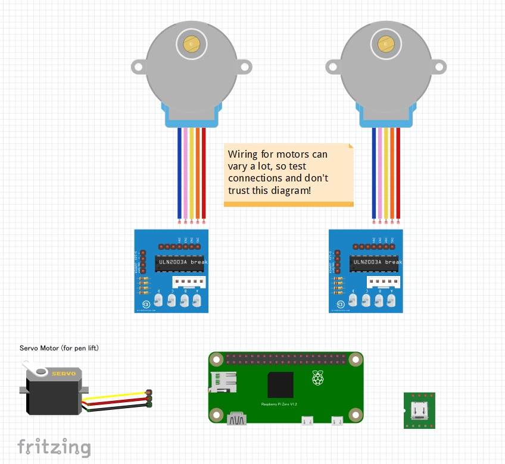

# Drawbot-mint

Drawing robot capable of rendering SVG paths over WebSockets. Powered by a Raspberry Pi running Node.js.

## Parts List
### JPY 100 Parts
* [木製 アイススティック棒　50本](100 Yen shop DAISO or Seria in Japan) ( use 4 sticks) JPY 100
* [釣り糸 0.8号](100 Yen shop DAISO in Japan) (x2) JPY 200

### Everything Else (~$150 or less)

* [Zafina 電圧 ステッピングモーター DC 5Vステッパーモーター 28BYJ-48 28BYJ48 ドライバーボード](https://amzn.to/2oSu4nK) (x2) - JPY 672
* [DIP　5ピン DIP変換　2.54mm　マイクロ　USB　電子部品　10個](https://amzn.to/2W0GtSQ) (only need 1) - JPY 369
* [Raspberry Pi Zero W](https://www.switch-science.com/catalog/3200/) - JPY 1,320)
* [RCカーボートヘリコプター飛行機トレックス450の SG90ミニギアマイクロサーボ](https://amzn.to/2P5JhN7) - JPY 389
* [USB充電器 ACアダプター 2A](https://amzn.to/2VXKLdt) - JPY 369
* [Micro USB USB A-MicroBケーブル 2m](https://amzn.to/2BCb2VD) - JPY 481
* [フランジモータガイド シャフト コネクタ DIY用品インナフランジ カプラモータ 4点セット 5mm](https://amzn.to/2VTaQKD) (x2) - JPY 339
* 4 screws for motors (M3-.50 x 4mm metric machine screws)
* 1-2 small screws 
* Standard wire or jumper wires (and headers for components if using jumpers)
* Micro SD card for Raspberry Pi zero (class 10 or better)

## Wiring



## Hardware Assembly

Thank you to the kind people at the Johnson County Library's Black & Veatch [MakerSpace](https://www.jocolibrary.org/makerspace) for documenting the assembly process at [instructables.com](https://www.instructables.com/id/Drawbot/).

## Raspberry Pi Zero W Basic Setup
1. **Download and install [Etcher](https://etcher.io/)**.
2. **Download and install latest [Raspbian OS](https://www.raspberrypi.org/downloads/raspbian/)** and flash it onto your SD card with Etcher.
3. **Enable SSH** by adding a blank file named `ssh` (no extension) to the `boot` directory on the Pi's SD card. (Last tested with Raspbian Stretch Lite 2018-06-27 version.)
4. **Set up Wifi** by adding a file named `wpa_supplicant.conf` to the same `boot` directory with the following contents (replace `MySSID` and `MyPassword` with your credentials):  
	```
	ctrl_interface=DIR=/var/run/wpa_supplicant GROUP=netdev
	update_config=1
		
	network={ 
		ssid="MySSID" 
		psk="MyPassword" 
	}
	```

## Software Prerequisites
From a device connected to the same network as the Drawbot Pi, SSH into the Pi with `ssh pi@raspberrypi.local`. The default password is `raspberry`.

Then, on the Drawbot Pi:

1. **Update, upgrade, and install NPM, Git.** (Automatically answer "yes" to everything.):
	* `sudo apt-get update`
	* `sudo apt-get upgrade`
	* `sudo apt-get install npm`
	* `sudo apt-get install git`

2. **Install Node.js.**
	* `sudo npm install -g n` (Install **n** for node.js version management. [github.com/tj/n](https://github.com/tj/n))
	* `sudo n stable` (Install latest stable version of Node.js. Last tested with v10.8.0)

3. **Upgrade NPM.** (and remove old apt-get version).
	* `sudo npm install npm@latest -g`
	* `sudo apt-get remove npm`
	* `sudo reboot` (After rebooting, you'll have to SSH into the Pi again.)

4. **Install pigpio C library.** [npmjs.com/package/pigpio](https://www.npmjs.com/package/pigpio)
	* `sudo apt-get install pigpio` (Only if you're using Raspbian *Lite*.)
	* `npm install pigpio`

## Installation
On the Drawbot Pi:

1. `git clone https://github.com/andywise/drawbot.git` to clone this repository.
2. `cd drawbot`
3. `npm i`

## Use
On the Drawbot Pi:

* Run `npm start` or `sudo node draw.js` to start the Drawbot controller.

## Controlling the Drawbot
On a device connected to the same local network as the Drawbot Pi:

* Go to [raspberrypi.local/control](http://raspberrypi.local/control) to access the Drawbot control interface.
* Use the "bullseye" interface to manually position the gondola, or raise/lower the pen/marker.
* Use the settings panel to configure the Drawbot's `D`, `X`, and `Y` values (see "Configuration" below).
* Drag and drop an SVG file onto the control interface to send artwork to the Drawbot!

### SVG Artwork Notes:
* **Only the first `<path>` element will be drawn**, so if necessary, combine artwork into a single compound path.
* The Drawbot will scale artwork so that **1 pixel = 1 millimeter**.

## Configuration
* **Enter value for `D`:** measure distance between string starting points (in millimeters).
* **Enter starting `X` and `Y` values:** measure distance from left and top (respectively) of left string starting point to initial pen position (also in mm).
* Note: Values will be stored in the `config.json` file.

## Rendering Raster Artwork (Coming Soon!)
* For now, go check out ["TSP Art."](https://wiki.evilmadscientist.com/TSP_art)
